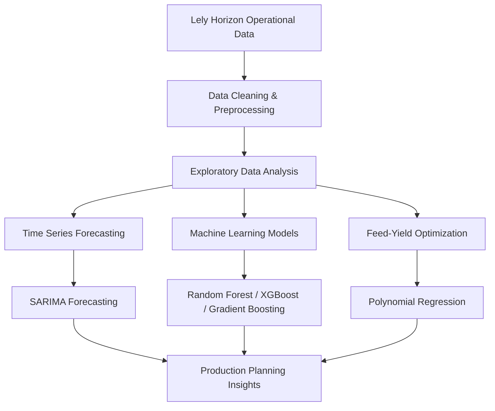

# Big Data Analytics for Dairy Production Optimization

Master of Data Science Capstone Project  
University of Melbourne · October 2024

[](https://github.com/Cloudduoduo/DS_project)
[](#)
[](#)

## Overview

This capstone project applies data analytics and machine learning to dairy production optimization. Using operational data from Lely Horizon farm management systems, the project explores how forecasting, regression, and machine learning models can support better production planning, feed optimization, and operational decision-making.

The repository is kept as a portfolio record of the project, including data preparation, exploratory analysis, modeling notebooks, reports, and supporting project materials.

## Key Questions

- How can milk production be forecasted over a long-term horizon?
- Which operational features are most useful for predicting milk yield?
- Can feed consumption be optimized without reducing production performance?
- What bottlenecks can be identified from robot and sensor-level farm data?

## Main Outcomes

- Built herd-level milk yield prediction models with strong explanatory performance.
- Developed time-series forecasting workflows for long-term milk production trends.
- Used polynomial regression to estimate feed-yield optimization thresholds.
- Compared machine learning models across herd-level and device-level datasets.
- Produced project reports and analysis materials for a capstone-style delivery.

## Technical Approach



## Models and Methods

- Time-series forecasting with SARIMA-style modeling
- Regression analysis for feed-yield threshold estimation
- Random Forest and Gradient Boosting models for milk yield prediction
- Hyperparameter tuning with cross-validation
- Exploratory data analysis and visualization
- Notebook-based reporting and reproducible analysis workflows

## Repository Structure

```text
.
├── EDA/                    # Exploratory data analysis
├── Machine Learning/       # Machine learning notebooks and model experiments
├── Merging Data/           # Data merging and preprocessing work
├── Polynomial Regression/  # Feed-yield optimization analysis
├── Time Series/            # Forecasting analysis
├── Report/                 # Final report and written materials
├── Recorded Meetings/      # Project meeting materials
├── dataset_S1/             # Dataset folder
├── dataset_S2/             # Dataset folder
├── requirements.txt        # Python dependencies
└── setup_structure.sh      # Repository structure helper
```

## Requirements

- Python 3.8+
- Jupyter Notebook or JupyterLab
- R for R-based analysis files, if used

Install Python dependencies:

```bash
pip install -r requirements.txt
```

## Quick Start

```bash
git clone https://github.com/Cloudduoduo/DS_project
cd DS_project
pip install -r requirements.txt
jupyter lab
```

Then open the analysis notebooks under:

- `EDA/`
- `Machine Learning/`
- `Polynomial Regression/`
- `Time Series/`

## Notes

- This repository is a forked capstone project archive under the `Cloudduoduo` account.
- Some source data may be course- or project-specific and may not be fully reusable outside the original project context.
- The README has been organized to make the project easier to understand as a data science portfolio item.
